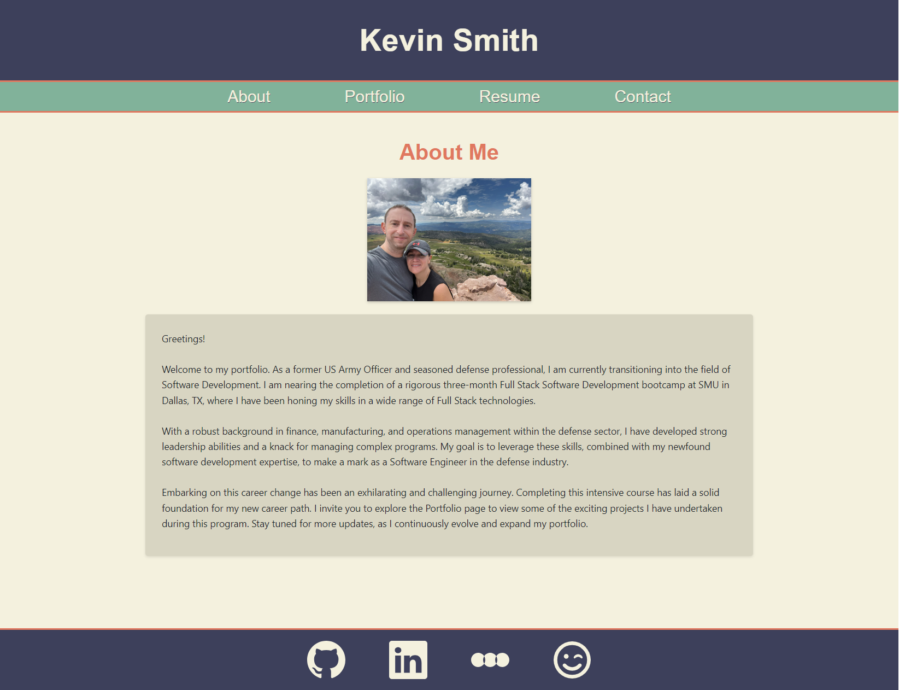

# Kevin Smith's React Portfolio

## Description

This is my personal React.js based website to let people know a little bit about me and to be able to showcase some of the projects I have created utilizing the skills I have learned while attending this Full Stack Coding Boot Camp.

## Usage

To visit my site, please click on the link below. There are navigation links provided to visit the various pages.

[Link to Kevin's Portfolio site](https://kevinasmith.netlify.app/)

Screenshot of the site:

## Credits

Special thanks to Leif Hetland and Fred Kamm, our class instructors, for teaching and support for this material and also oft needed morale boosting. I referenced code guidance from the class repository to assist with this project.

In completing this project, I utilized the below resources to assist:

https://vitejs.dev/guide/  
https://react.dev/learn  
https://legacy.reactjs.org/docs/getting-started.html  
https://reactrouter.com/en/main  
https://react-bootstrap-v4.netlify.app/components/badge/  
https://react-icons.github.io/react-icons/  
https://app.netlify.com/teams/kevinsmithseven/sites

## License

This project is covered under the MIT License.

## Badges

## Questions

Please visit my [GitHub profile](https://github.com/kevinsmithseven/) or email me at [kevinsmithseven@gmail.com](mailto:kevinsmithseven@gmail.com) with any questions.
